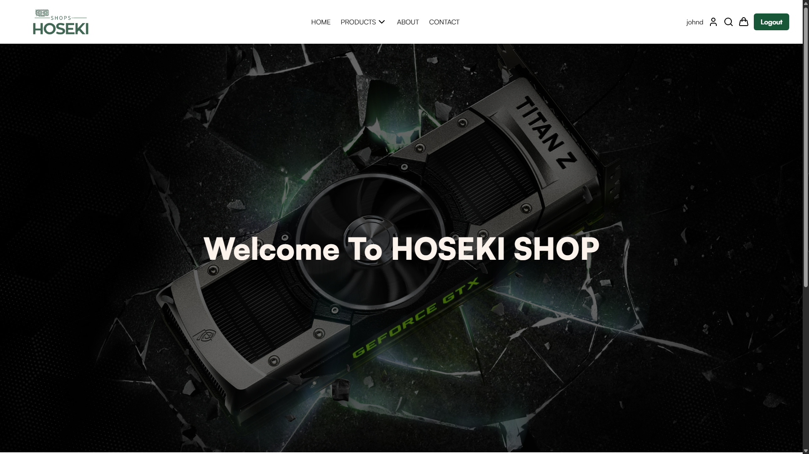
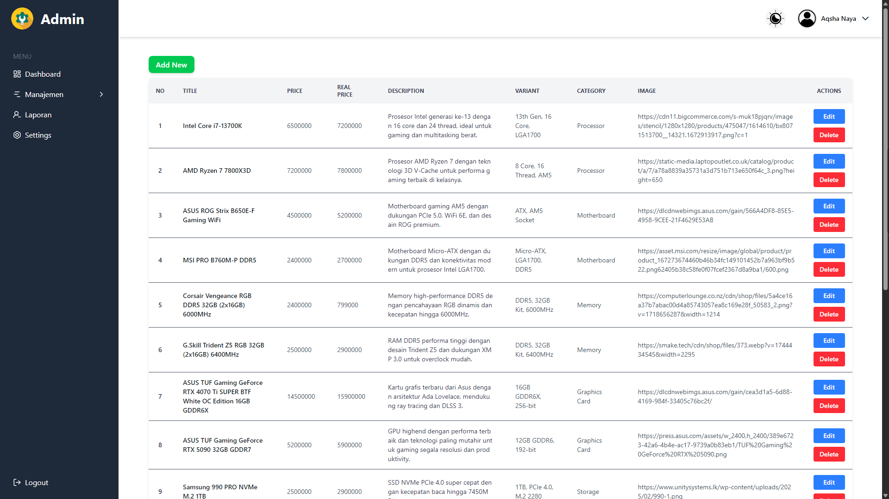
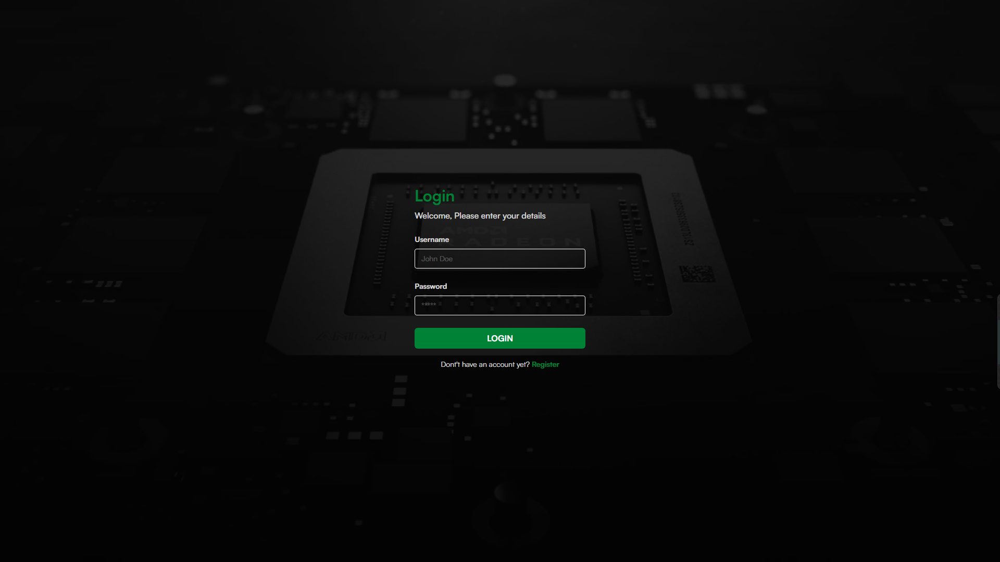
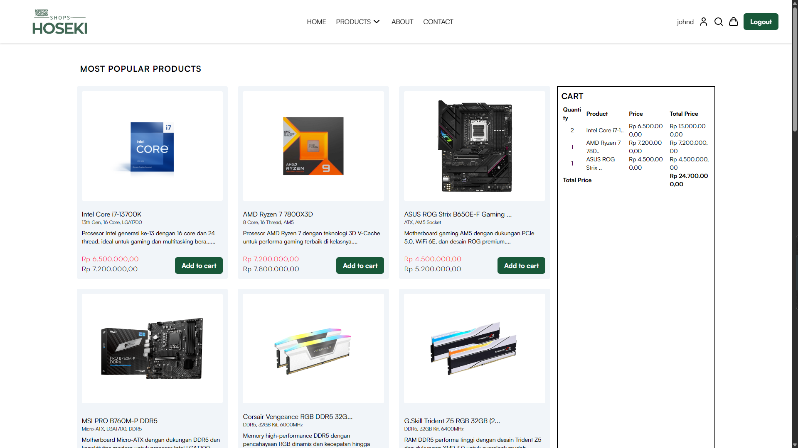

# 🛒 HOSEKI — Fullstack E-Commerce Project



**HOSEKI** adalah proyek **E-Commerce Web Application** yang dikembangkan sebagai bagian dari mata kuliah **DevOps (Pengembangan dan Operasi)**.  
Aplikasi ini dirancang dan dikembangkan **sepenuhnya dari nol** menggunakan **Node.js (Backend)** dan **React.js (Frontend)** dengan konsep **Fullstack Web Development**.

Proyek ini bertujuan untuk memahami dan menerapkan praktik pengembangan perangkat lunak modern mulai dari desain arsitektur, manajemen database, hingga pengoperasian (deployment) dalam konteks DevOps.

---

## 🚀 Tech Stack

| Layer                      | Teknologi yang Digunakan                |
| -------------------------- | --------------------------------------- |
| **Frontend (E-Commerce)**  | React.js, Vite, Tailwind CSS            |
| **Frontend (Admin Panel)** | React.js, React Router, Axios           |
| **Backend**                | Node.js, Express.js                     |
| **Database**               | PostgreSQL / MySQL (melalui Prisma ORM) |
| **Tools & DevOps**         | Git, GitHub, npm, dotenv, Postman       |
| **Authentication**         | JWT (JSON Web Token)                    |
| **Hosting (Opsional)**     | Render / Vercel / Railway (belum final) |

---

## 🧩 Fitur Utama

### 🧑‍💻 **Admin Panel (Frame)**



Admin memiliki akses ke sistem manajemen data dan analitik melalui dashboard yang intuitif:

- **Manajemen Produk:** CRUD produk (judul, harga, deskripsi, varian, kategori, gambar).
- **Manajemen Pengguna:** Menampilkan dan mengelola data pengguna terdaftar.
- **Manajemen Transaksi & Laporan:** Melihat riwayat transaksi dan data penjualan.
- **Dark/Light Mode:** Tampilan fleksibel dan modern.

---

### 🛍️ **E-Commerce Platform (Hoseki Shop)**




Platform utama yang digunakan oleh pengguna (customer):

- **Autentikasi Pengguna:** Login dan registrasi akun.
- **Daftar Produk Populer:** Menampilkan produk dengan deskripsi, harga asli, dan harga promo.
- **Keranjang Belanja (Cart):** Tambah produk, hitung total harga secara dinamis.
- **Antarmuka Responsif:** Desain bersih dan mudah digunakan di desktop maupun mobile.
- **Integrasi Backend:** Mengambil data produk dan pengguna secara real-time melalui API.

---

### ⚙️ **Backend API Service**

Backend berfungsi sebagai pusat logika bisnis dan penghubung antara database dengan antarmuka pengguna:

- RESTful API menggunakan **Express.js**
- Otentikasi berbasis **JWT**
- Validasi data input
- Integrasi dengan **Prisma ORM**
- Endpoint CRUD untuk produk, pengguna, dan transaksi
- Pengaturan environment menggunakan `.env`

---

## 📂 Struktur Proyek

```
DevOps_Class_Project/
│
├── backend/               # Backend API (Node.js + Express)
│   ├── prisma/             # Prisma schema & migrations
│   ├── routes/             # Endpoint API
│   ├── controllers/        # Logic tiap fitur
│   ├── middleware/         # JWT & error handler
│   └── server.js
│
├── frontend-admin/        # React Admin Panel
│   ├── src/pages/
│   ├── src/components/
│   └── src/services/axios.js
│
├── frontend-shop/         # React E-Commerce User Site
│   ├── src/pages/
│   ├── src/components/
│   └── src/context/
│
└── README.md
```

---

## ⚡ Cara Menjalankan Proyek (Lokal)

### 1. Clone Repository

```bash
git clone https://github.com/HOSEKI7/DevOps_Class_Project.git
cd DevOps_Class_Project
```

### 2. Setup Backend

```bash
cd backend
npm install
npx prisma generate
npx prisma migrate dev
npx prisma seed db
npm run dev
```

### 3. Setup Frontend (Shop & Admin)

```bash
cd ../frontend-shop
npm install
npm run dev

cd ../frontend-admin
npm install
npm run dev
```

Akses aplikasi melalui:

- 🛍️ E-Commerce: `http://localhost:5173`
- 🧑‍💻 Admin Panel: `http://localhost:5174`
- ⚙️ API Server: `http://localhost:3000`

---

## 🧠 Tujuan & Pembelajaran

Proyek **HOSEKI E-Commerce** ini menjadi wadah untuk:

- Mempelajari **konsep DevOps** dengan mengintegrasikan proses pengembangan dan operasi.
- Mengasah kemampuan **Fullstack Web Development** (Frontend & Backend).
- Menerapkan **manajemen API, autentikasi, database ORM, dan state management**.
- Menjalankan praktik kerja tim dan kontrol versi dengan **Git & GitHub**.
- Mempersiapkan sistem agar siap untuk tahap **CI/CD & deployment otomatis** di masa depan.

---

## 🔮 Rencana Pengembangan

- [ ] Menambahkan fitur **Checkout dan Payment Gateway**
- [ ] Menyempurnakan **Dashboard Analitik Penjualan**
- [ ] Implementasi **CI/CD Pipeline**
- [ ] Deployment di platform cloud (Render/Vercel/Railway)
- [ ] Penambahan **Testing (Jest / Vitest)**

---

## 📸 Preview Screenshots

| Login Page                   | Shop Page                  | Admin Panel                  |
| ---------------------------- | -------------------------- | ---------------------------- |
|  |  |  |

---

## 🧾 Lisensi

Proyek ini dibuat untuk keperluan pembelajaran akademik dalam mata kuliah **DevOps (Pengembangan dan Operasi)**.  
Hak cipta © 2025 — **Farid Zahran (HOSEKI7)**.  
Semua aset dan kode bersifat terbuka untuk digunakan dalam konteks edukasi.
